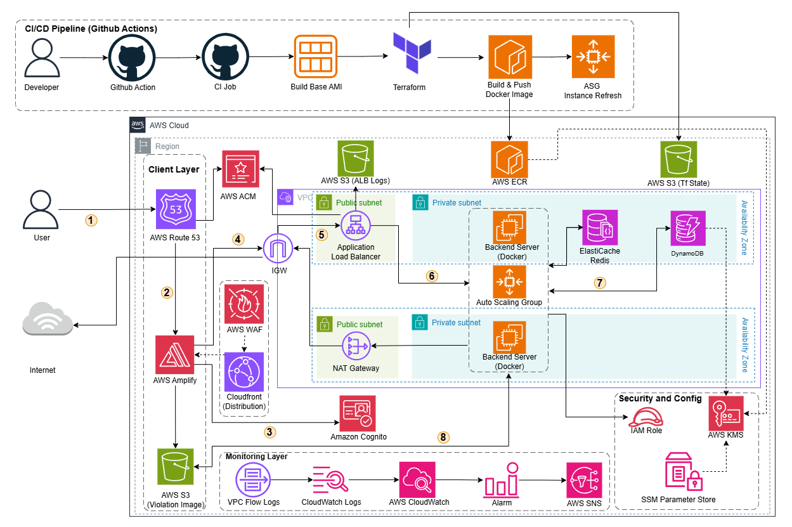

cuTrust — AI-Powered Online Exam Monitoring Platform
## AWS-Integrated Fullstack Solution for Exam Proctoring and Smart Learning Support

### 1. Executive Summary
EduTrust is an online exam management platform designed for educational environments (schools, training centers) to digitize the exam organization process, proctor exams using AI, and support learning through a smart chatbot. The system serves 3 main user groups: **Admins** (schools), **Teachers** (creating exams, proctoring), and **Students** (taking exams, viewing results). The backend uses FastAPI (Python) combined with MongoDB, Redis, Amazon S3, and the YOLO model for cheating detection via camera. The frontend is built with Next.js and Tailwind CSS, deployed on AWS Amplify.

### 2. Problem Statement
*Current Problems*
Organizing online exams in schools faces many challenges: manual proctoring is labor-intensive, cheating is difficult to detect (using phones, multiple people in frame, leaving the camera), there is no centralized system to manage classes — exams — results, and there is a lack of smart learning support tools for students.

*The Solution*
EduTrust provides a comprehensive platform including:
- **Class & Exam Management**: Admins create classes, assign homeroom and subject teachers; teachers create multiple-choice exams with secret keys and set start/end times.
- **AI Proctoring**: Integrates YOLOv26n (object detection) to detect violations via webcam in real-time — including detecting multiple faces (MULTIPLE_FACES), leaving the camera (FACE_DISAPPEARED: cell Phone), and forbidden objects (FORBIDDEN_OBJECT). Violation images are uploaded to Amazon S3 and logged in MongoDB.
- **AI Learning Assistant Chatbot**: A multi-agent system using Pydantic AI with specialized agents (technical, social, general, web search) helps students look up knowledge, ask questions, and search for documents.
- **Authentication & Security**: JWT tokens (using Cognito) for Role-Based Access Control (RBAC).

*Benefits and Return on Investment (ROI)*
The solution helps reduce the manual proctoring workload for teachers, improving transparency and fairness in exams. The system automatically grades, records violations with photographic evidence, and provides a dashboard summarizing results. Operating costs are low due to leveraging MongoDB Atlas (free tier), Redis Cloud, and AWS S3/Amplify. Estimated AWS infrastructure cost is under $5/month for a medium-sized school.

### 3. Solution Architecture
The platform applies a **Fullstack monorepo** architecture with a Python (FastAPI) backend and a Next.js frontend, deployed via Docker containers. Data is stored on MongoDB (collections: users, exams, classes, submissions, violations), conversation sessions are cached on Redis, and violation images are on Amazon S3.

*Services & Technology Used (by architecture)*
- *AWS Amplify + CloudFront*: Next.js frontend hosting and content delivery via CDN.
- *AWS Route 53 + AWS ACM*: DNS and TLS/HTTPS certificate management.
- *AWS WAF*: Web layer protection against common attack patterns.
- *Amazon VPC (public/private subnets)*: Network isolation, separating public/private tiers.
- *Application Load Balancer (ALB)*: Coordinating requests to the backend.
- *Amazon EC2 Auto Scaling*: Operating the backend according to load with auto-scaling capabilities.
- *Amazon ECR*: Storing Docker images for the backend.
- *Amazon S3*: Storing violation images, ALB logs, and Terraform state.
- *Amazon DynamoDB*: Fast key-value data storage (based on architecture diagram).
- *Amazon ElastiCache for Redis*: Caching sessions/conversations and fast-access data.
- *Amazon Cognito*: User authentication, role-based authorization.
- *Amazon CloudWatch + VPC Flow Logs + SNS*: Monitoring, logging, and alerting.
- *AWS KMS + SSM Parameter Store + PrivateLink*: Securing secrets and internal access.
- *Terraform + GitHub Actions*: IaC and CI/CD for automated deployment.

*Applied Technologies*
- *FastAPI*: Backend API framework — async, auto-generated docs (Swagger/ReDoc).
- *Next.js 16 + Tailwind CSS v4*: Frontend SPA with App Router, server/client components.
- *YOLOv26n (Ultralytics)*: Object detection model for exam proctoring.
- *Pydantic AI + LiteLLM*: Multi-agent orchestrator for the learning support chatbot.
- *Docker*: Containerizing the backend with multi-stage build (Ubuntu 24.04).

*Component Design*
- *Authentication (Auth)*: JWT access/refresh tokens, session management via cookies, RBAC authorization (admin/teacher/student).
- *Class Management*: Assigning homeroom/subject teachers, adding/removing students, automatically updating status (active/inactive).
- *Exam Management*: Creating multiple-choice exams, automatic secret codes, time control (start/end time), automatic grading upon submission.
- *Camera Monitoring (Detection)*: CameraService receives frames from clients, ObjectDetector (YOLO) detects violations, ViolationLogger logs to MongoDB + S3, ScreenshotUtils captures evidence photos.
- *AI Agent*: UnifiedAgent orchestrates sub-agents (technical, social, general, web_search) via tool delegation, streaming responses via WebSocket.

### 4. Technical Implementation
*Implementation Phases*
The project is divided into 5 main phases:
1. *Learning foundational AWS services*: Familiarizing with services in the architecture (VPC, EC2/ALB/ASG, S3, ECR, Cognito, CloudWatch, KMS, SSM, WAF) and the CI/CD/IaC process.
2. *Research and architecture design*: Researching technologies (FastAPI, Next.js, YOLO, Pydantic AI), designing database schema, API contracts, and system architecture.
3. *Developing core features*: Building the auth system (Cognito JWT), class CRUD, exam management, automatic grading.
4. *Integrating AI & Camera*: Integrating YOLO for violation detection, building the multi-agent chatbot system, connecting S3/Redis.
5. *Frontend & testing*: Completing the Next.js dashboard for the 3 roles, end-to-end testing, and Dockerization.

*Technical Requirements*
- *Backend*: Python ≥ 3.11, FastAPI, Motor (async MongoDB driver), Redis ≥ 5.0, Boto3 (AWS SDK), Ultralytics (YOLO), Pydantic AI + LiteLLM, Kreuzberg (document parsing), SlowAPI (rate limiting).
- *Frontend*: Next.js 16, React 19, Tailwind CSS v4, Lucide React (icons), React Markdown + KaTeX (math rendering), ONNX Runtime Web, next-intl (i18n).
- *Infrastructure*: Docker (multi-stage build), MongoDB Atlas, Redis Cloud, Amazon S3, AWS Amplify, Logfire (observability).

### 5. Timeline & Milestones
- *Weeks 1–2*: Learning AWS services based on the architecture (VPC, EC2/ALB/ASG, S3, ECR, Cognito, CloudWatch, KMS/SSM, WAF) and the CI/CD/IaC process.
- *Weeks 3–4*: Researching technologies, designing architecture and database schema.
- *Weeks 5–6*: Developing backend core (auth, classes, exams, submissions).
- *Weeks 7–8*: Integrating YOLO detection, AI chatbot (multi-agent), S3 storage.
- *Week 9*: Developing frontend dashboard (admin/teacher/student views).
- *Week 10*: Integration testing, performance optimization, and Dockerization.

### 6. Budget Estimation

*Architectural Assumptions*
- Small environment (staging/small production), low–medium traffic.
- Backend running on EC2 Auto Scaling (t3.small, 2 instances), ALB operating 24/7.
- Frontend hosted on Amplify + CloudFront, using WAF.
- Violation data stored on S3 (~10–20 GB/month).

*Infrastructure Costs (monthly – estimated)*

| Service | TP ($) | Forcasting 1 month ($) |
| :--- | :--- | :--- |
| VPC | 0.00 | 0.00 |
| EC2-Other | 1.57 | 47.10 |
| EC2-Instances | 1.27 | 38.10 |
| Elastic Load Balancing | 0.61 | 18.30 |
| Amplify | 0.62 | 18.60 |
| WAF | 0.53 | 15.90 |
| ElastiCache | 0 - 1.15 | 9 - 14 |
| KMS | - | 2.00 |
| Route 53 | 0.51 | |
| ECR | - | 0.3 (3GB) |
| S3 | - | 0.03 (1GB) |
| DynamoDB | 0.00 | 0.00 |
| Cognito | 0.00 | 0.00 |
| SNS | 0.00 | 0.00 |

*Third-party API Costs*
- OpenAI/LiteLLM API: based on usage.
- External search services (if used): based on plan.

### 7. Risk Assessment
*Risk Matrix*
- Low YOLO accuracy (false positive/negative): High impact, medium probability.
- Student network/camera disconnection: Medium impact, medium probability.
- Exceeding API budget (LLM calls): Medium impact, low probability.
- Switching from MongoDB to MySQL causing schema changes & complex queries: Medium-high impact, medium probability.

*Mitigation Strategies*
- YOLO: Adjust confidence threshold (min 0.5), only alert after multiple consecutive frames, allow teachers to manually review violations.
- Network: Client-side detection with ONNX Runtime Web (fallback), log violations locally and sync when back online.
- API Costs: Rate limiting (SlowAPI), set budget alerts, use lighter models for simple tasks.
- Database: Design repository layer to abstract DB, normalize schema, prepare data migration scripts if switching to MySQL.

*Contingency Plans*
- Switch to manual proctoring (teachers viewing live camera) if AI detection fails.
- Use SQLite/local storage as fallback if MongoDB Atlas is unavailable.
- Docker image allows quick deployment on any cloud provider (no AWS lock-in).

### 8. Expected Outcomes
*Technical Improvements*: Automating the exam monitoring process with AI (YOLO) replacing manual proctoring. Automatic multiple-choice grading, recording violations with photographic evidence on S3. Multi-agent AI chatbot supporting student learning 24/7.
*Long-term Value*: The platform can be scaled to multiple schools, support multi-language (next-intl), integrate more exam types (essays with AI grading), and develop into a complete educational SaaS. Accumulated violation data can be used to improve the detection model over time.
c---
title: "Proposal"
date: 2024-01-01
weight: 2
chapter: false
pre: " <b> 2. </b> "
---
<!--
{}
⚠️ **Note:** The information below is for reference purposes only. Please **do not copy verbatim** for your report, including this warning.
{}
-->

In this section, you need to summarize the contents of the workshop that you **plan** to conduct. -->

# EduTrust — AI-Powered Online Exam Monitoring Platform
## AWS-Integrated Fullstack Solution for Exam Proctoring and Smart Learning Support

### 1. Executive Summary
EduTrust is an online exam management platform designed for educational environments (schools, training centers) to digitize the exam organization process, proctor exams using AI, and support learning through a smart chatbot. The system serves 3 main user groups: **Admins** (schools), **Teachers** (creating exams, proctoring), and **Students** (taking exams, viewing results). The backend uses FastAPI (Python) combined with MongoDB, Redis, Amazon S3, and the YOLO model for cheating detection via camera. The frontend is built with Next.js and Tailwind CSS, deployed on AWS Amplify.

### 2. Problem Statement
*Current Problems*
Organizing online exams in schools faces many challenges: manual proctoring is labor-intensive, cheating is difficult to detect (using phones, multiple people in frame, leaving the camera), there is no centralized system to manage classes — exams — results, and there is a lack of smart learning support tools for students.

*The Solution*
EduTrust provides a comprehensive platform including:
- **Class & Exam Management**: Admins create classes, assign homeroom and subject teachers; teachers create multiple-choice exams with secret keys and set start/end times.
- **AI Proctoring**: Integrates YOLOv26n (object detection) to detect violations via webcam in real-time — including detecting multiple faces (MULTIPLE_FACES), leaving the camera (FACE_DISAPPEARED: cell Phone), and forbidden objects (FORBIDDEN_OBJECT). Violation images are uploaded to Amazon S3 and logged in MongoDB.
- **AI Learning Assistant Chatbot**: A multi-agent system using Pydantic AI with specialized agents (technical, social, general, web search) helps students look up knowledge, ask questions, and search for documents.
- **Authentication & Security**: JWT tokens (using Cognito) for Role-Based Access Control (RBAC).

*Benefits and Return on Investment (ROI)*
The solution helps reduce the manual proctoring workload for teachers, improving transparency and fairness in exams. The system automatically grades, records violations with photographic evidence, and provides a dashboard summarizing results. Operating costs are low due to leveraging MongoDB Atlas (free tier), Redis Cloud, and AWS S3/Amplify. Estimated AWS infrastructure cost is under $5/month for a medium-sized school.

### 3. Solution Architecture
The platform applies a **Fullstack monorepo** architecture with a Python (FastAPI) backend and a Next.js frontend, deployed via Docker containers. Data is stored on MongoDB (collections: users, exams, classes, submissions, violations), conversation sessions are cached on Redis, and violation images are on Amazon S3.

*Services & Technology Used (by architecture)*
- *AWS Amplify + CloudFront*: Next.js frontend hosting and content delivery via CDN.
- *AWS Route 53 + AWS ACM*: DNS and TLS/HTTPS certificate management.
- *AWS WAF*: Web layer protection against common attack patterns.
- *Amazon VPC (public/private subnets)*: Network isolation, separating public/private tiers.
- *Application Load Balancer (ALB)*: Coordinating requests to the backend.
- *Amazon EC2 Auto Scaling*: Operating the backend according to load with auto-scaling capabilities.
- *Amazon ECR*: Storing Docker images for the backend.
- *Amazon S3*: Storing violation images, ALB logs, and Terraform state.
- *Amazon DynamoDB*: Fast key-value data storage (based on architecture diagram).
- *Amazon ElastiCache for Redis*: Caching sessions/conversations and fast-access data.
- *Amazon Cognito*: User authentication, role-based authorization.
- *Amazon CloudWatch + VPC Flow Logs + SNS*: Monitoring, logging, and alerting.
- *AWS KMS + SSM Parameter Store + PrivateLink*: Securing secrets and internal access.
- *Terraform + GitHub Actions*: IaC and CI/CD for automated deployment.

*Applied Technologies*
- *FastAPI*: Backend API framework — async, auto-generated docs (Swagger/ReDoc).
- *Next.js 16 + Tailwind CSS v4*: Frontend SPA with App Router, server/client components.
- *YOLOv26n (Ultralytics)*: Object detection model for exam proctoring.
- *Pydantic AI + LiteLLM*: Multi-agent orchestrator for the learning support chatbot.
- *Docker*: Containerizing the backend with multi-stage build (Ubuntu 24.04).

*Component Design*
- *Authentication (Auth)*: JWT access/refresh tokens, session management via cookies, RBAC authorization (admin/teacher/student).
- *Class Management*: Assigning homeroom/subject teachers, adding/removing students, automatically updating status (active/inactive).
- *Exam Management*: Creating multiple-choice exams, automatic secret codes, time control (start/end time), automatic grading upon submission.
- *Camera Monitoring (Detection)*: CameraService receives frames from clients, ObjectDetector (YOLO) detects violations, ViolationLogger logs to MongoDB + S3, ScreenshotUtils captures evidence photos.
- *AI Agent*: UnifiedAgent orchestrates sub-agents (technical, social, general, web_search) via tool delegation, streaming responses via WebSocket.

### 4. Technical Implementation
*Implementation Phases*
The project is divided into 5 main phases:
1. *Learning foundational AWS services*: Familiarizing with services in the architecture (VPC, EC2/ALB/ASG, S3, ECR, Cognito, CloudWatch, KMS, SSM, WAF) and the CI/CD/IaC process.
2. *Research and architecture design*: Researching technologies (FastAPI, Next.js, YOLO, Pydantic AI), designing database schema, API contracts, and system architecture.
3. *Developing core features*: Building the auth system (Cognito JWT), class CRUD, exam management, automatic grading.
4. *Integrating AI & Camera*: Integrating YOLO for violation detection, building the multi-agent chatbot system, connecting S3/Redis.
5. *Frontend & testing*: Completing the Next.js dashboard for the 3 roles, end-to-end testing, and Dockerization.

*Technical Requirements*
- *Backend*: Python ≥ 3.11, FastAPI, Motor (async MongoDB driver), Redis ≥ 5.0, Boto3 (AWS SDK), Ultralytics (YOLO), Pydantic AI + LiteLLM, Kreuzberg (document parsing), SlowAPI (rate limiting).
- *Frontend*: Next.js 16, React 19, Tailwind CSS v4, Lucide React (icons), React Markdown + KaTeX (math rendering), ONNX Runtime Web, next-intl (i18n).
- *Infrastructure*: Docker (multi-stage build), MongoDB Atlas, Redis Cloud, Amazon S3, AWS Amplify, Logfire (observability).

### 5. Timeline & Milestones
- *Weeks 1–2*: Learning AWS services based on the architecture (VPC, EC2/ALB/ASG, S3, ECR, Cognito, CloudWatch, KMS/SSM, WAF) and the CI/CD/IaC process.
- *Weeks 3–4*: Researching technologies, designing architecture and database schema.
- *Weeks 5–6*: Developing backend core (auth, classes, exams, submissions).
- *Weeks 7–8*: Integrating YOLO detection, AI chatbot (multi-agent), S3 storage.
- *Week 9*: Developing frontend dashboard (admin/teacher/student views).
- *Week 10*: Integration testing, performance optimization, and Dockerization.

### 6. Budget Estimation

*Architectural Assumptions*
- Small environment (staging/small production), low–medium traffic.
- Backend running on EC2 Auto Scaling (t3.small, 2 instances), ALB operating 24/7.
- Frontend hosted on Amplify + CloudFront, using WAF.
- Violation data stored on S3 (~10–20 GB/month).

*Infrastructure Costs (monthly – estimated)*

| Service | TP ($) | Forcasting 1 month ($) |
| :--- | :--- | :--- |
| VPC | 0.00 | 0.00 |
| EC2-Other | 1.57 | 47.10 |
| EC2-Instances | 1.27 | 38.10 |
| Elastic Load Balancing | 0.61 | 18.30 |
| Amplify | 0.62 | 18.60 |
| WAF | 0.53 | 15.90 |
| ElastiCache | 0 - 1.15 | 9 - 14 |
| KMS | - | 2.00 |
| Route 53 | 0.51 | |
| ECR | - | 0.3 (3GB) |
| S3 | - | 0.03 (1GB) |
| DynamoDB | 0.00 | 0.00 |
| Cognito | 0.00 | 0.00 |
| SNS | 0.00 | 0.00 |

*Third-party API Costs*
- OpenAI/LiteLLM API: based on usage.
- External search services (if used): based on plan.

### 7. Risk Assessment
*Risk Matrix*
- Low YOLO accuracy (false positive/negative): High impact, medium probability.
- Student network/camera disconnection: Medium impact, medium probability.
- Exceeding API budget (LLM calls): Medium impact, low probability.
- Switching from MongoDB to MySQL causing schema changes & complex queries: Medium-high impact, medium probability.

*Mitigation Strategies*
- YOLO: Adjust confidence threshold (min 0.5), only alert after multiple consecutive frames, allow teachers to manually review violations.
- Network: Client-side detection with ONNX Runtime Web (fallback), log violations locally and sync when back online.
- API Costs: Rate limiting (SlowAPI), set budget alerts, use lighter models for simple tasks.
- Database: Design repository layer to abstract DB, normalize schema, prepare data migration scripts if switching to MySQL.

*Contingency Plans*
- Switch to manual proctoring (teachers viewing live camera) if AI detection fails.
- Use SQLite/local storage as fallback if MongoDB Atlas is unavailable.
- Docker image allows quick deployment on any cloud provider (no AWS lock-in).

### 8. Expected Outcomes
*Technical Improvements*: Automating the exam monitoring process with AI (YOLO) replacing manual proctoring. Automatic multiple-choice grading, recording violations with photographic evidence on S3. Multi-agent AI chatbot supporting student learning 24/7.
*Long-term Value*: The platform can be scaled to multiple schools, support multi-language (next-intl), integrate more exam types (essays with AI grading), and develop into a complete educational SaaS. Accumulated violation data can be used to improve the detection model over time.
