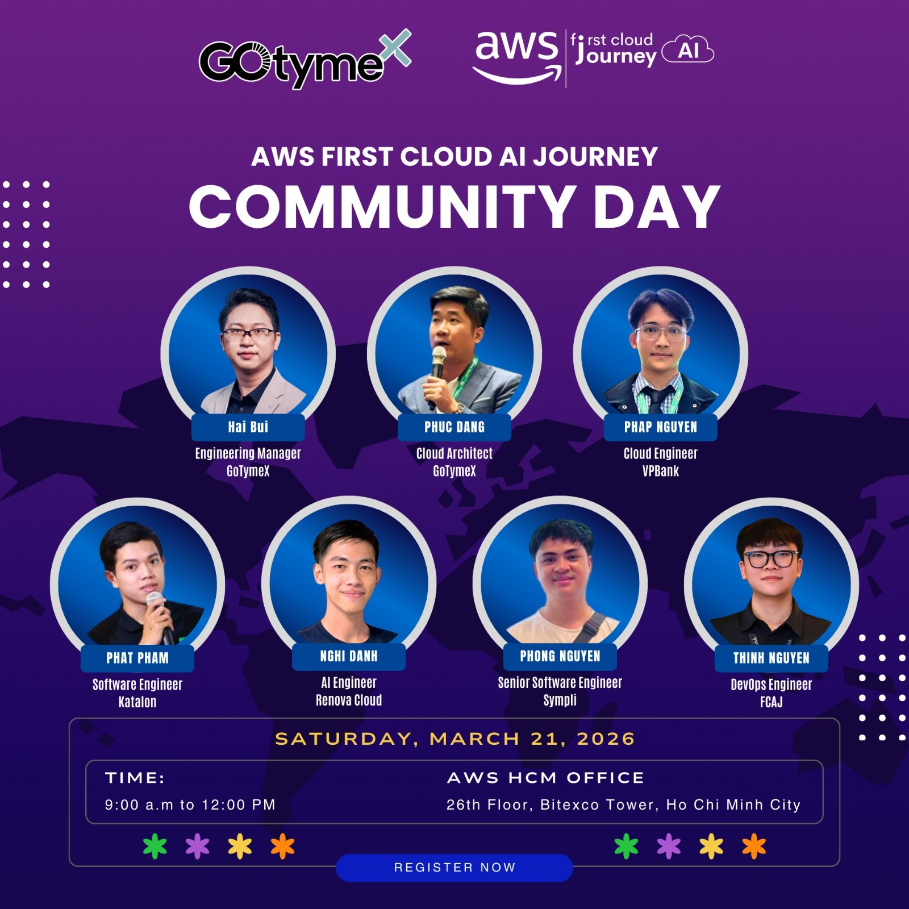

# Bài thu hoạch “AWS First Cloud AI Journey Community Day 2026”

### Thông tin sự kiện

- **Tên sự kiện:** AWS First Cloud AI Journey Community Day 2026  
- **Thời gian:** 09:00 – 12:00, Thứ Bảy, ngày 21/03/2026  
- **Địa điểm:** Tầng 26, Bitexco Financial Tower, TP. Hồ Chí Minh (AWS HCM Office)  
- **Vai trò:** Người tham dự  

### Mô tả

Đây là sự kiện cộng đồng quy tụ các chuyên gia trong lĩnh vực Cloud và AI nhằm chia sẻ kiến thức, xu hướng công nghệ mới, đặc biệt là trong hệ sinh thái Cloud và Generative AI.

Sự kiện cũng là buổi kickoff chính thức của FCAJ Bootcamp 2026, mở đầu hành trình học tập và phát triển kỹ năng Cloud cho sinh viên. Ngoài các bài chia sẻ chuyên môn, người tham gia còn có cơ hội trải nghiệm demo thực tế và mở rộng networking với các kỹ sư, chuyên gia trong ngành.

### Mục tiêu sự kiện

- Kết nối cộng đồng Cloud & AI tại Việt Nam
- Cập nhật xu hướng mới về Generative AI và hệ thống Cloud
- Giới thiệu các ứng dụng thực tế của AI trong production
- Định hướng nghề nghiệp trong lĩnh vực Platform Engineering, DevOps, AI Engineering
- Tạo môi trường học tập và phát triển cho sinh viên thông qua Bootcamp
### Diễn giả

- Hải Bùi – Engineering Manager (GotymeX)
- Phúc Đặng – Cloud Architect (GotymeX)
- Pháp Nguyễn – Cloud Engineer (VPBank)
- Phát Phạm – Software Engineer (Katalon)
- Nghi Danh – AI Engineer (Renova Cloud)
- Phong Nguyễn – Senior Software Engineer (Sympli)
- Thịnh Nguyễn – DevOps Engineer (FCAJ)

### Điểm nổi bật

- Chủ đề xuyên suốt: Agentic AI & GenAI trong thực tế
- Các nội dung đáng chú ý:
  - Platform Engineering & Career Pathways
  - GenAIOps – đưa AI vào production
  - Agentic Coding & Productivity tools
  - Multimodal AI, GraphRAG, Multi-Agent Systems
- Có demo thực tế trên AWS (Bedrock, EKS, Langfuse,...)
- Networking với chuyên gia trong ngành 

### Kết quả rút ra

- Hiểu rõ hơn về cách AI được triển khai trong môi trường production
- Nắm được xu hướng chuyển dịch từ DevOps → Platform Engineering
- Biết thêm về kiến trúc hệ thống AI hiện đại (Multi-agent, RAG, Observability)
- Có cái nhìn rõ ràng hơn về lộ trình nghề nghiệp trong Cloud & AI

### Ứng dụng vào công việc

- Áp dụng tư duy GenAIOps vào các dự án AI (monitoring, logging, scaling)
- Sử dụng các công cụ như:
  - RAG cho hệ thống truy vấn dữ liệu
  - Multi-agent để chia nhỏ bài toán
- Tối ưu pipeline AI (training → deployment → monitoring)
- Định hướng xây dựng hệ thống AI thực tế thay vì chỉ dừng ở model

### Trải nghiệm sự kiện

- Không khí năng động, chuyên nghiệp nhưng vẫn rất cởi mở
- Nội dung chia sẻ thực tế, không quá lý thuyết
- Có nhiều góc nhìn từ nhiều vị trí khác nhau (DevOps, AI, Cloud)
- Cơ hội networking rất tốt với người trong ngành

### Bài học rút ra

- AI không chỉ là model → quan trọng là deployment & vận hành
- Kiến thức Cloud là nền tảng bắt buộc nếu muốn làm AI thực tế
- Xu hướng tương lai là Agentic AI + Automation
- Muốn phát triển lâu dài cần:
  - Hiểu system design
  - Biết MLOps / DevOps
  - Có tư duy sản phẩm 

### Một số hình ảnh tham gia sự kiện

### Tổng kết

Chuỗi sự kiện đã cung cấp một bộ khung kiến thức vững chắc về DevOps hiện đại. Đây là nền tảng quan trọng để tôi áp dụng vào việc xây dựng và vận hành dự án EduTrust một cách chuyên nghiệp, sẵn sàng cho các bài toán quy mô lớn trên Cloud.
