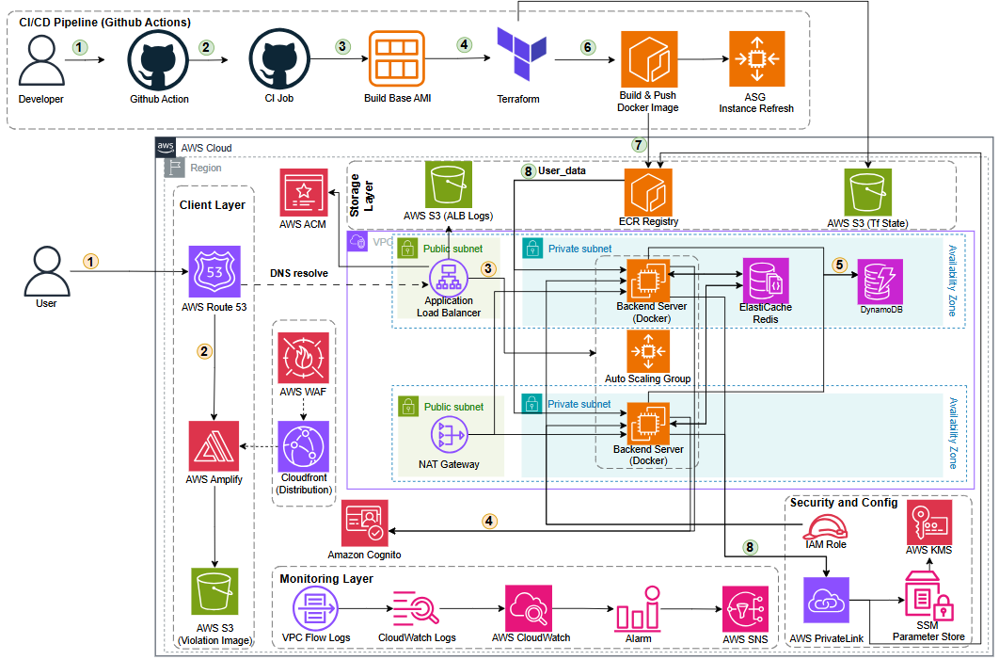

#### Giới thiệu

EduTrust là hệ thống hỗ trợ học tập và giám sát thi bằng AI Camera, được triển khai trên AWS để đảm bảo mở rộng, bảo mật và vận hành ổn định. Workshop này tập trung vào setup kiến trúc và luồng triển khai chuẩn cho nhóm.

#### Kiến trúc AWS tổng quan

Internet → Amplify → Application Load Balancer → EC2 Auto Scaling → Backend services

#### Thành phần chính (theo layer)

**Client/Presentation Layer**

+ **Amplify**: host frontend và kết nối custom domain.

**Traffic/Delivery Layer**

+ **Application Load Balancer**: phân phối request vào backend.

**Compute/Service Layer**

+ **EC2 Auto Scaling**: chạy các backend services theo tải.
+ **Backend services**: API, xử lý AI, camera events, auth.

**Data Layer**

+ **Data**: lưu trữ log, video, và kết quả bài thi (S3/DB).

#### Danh sách dịch vụ sử dụng

**Lớp giao diện & biên (Frontend & Edge)**

+ AWS Amplify
+ AWS WAF
+ AWS Route 53
+ AWS ACM

**Lớp định danh (Identity)**

+ Amazon Cognito

**Lớp mạng (Networking)**

+ Amazon VPC (public/private subnets)
+ Internet Gateway
+ NAT Gateway
+ Application Load Balancer

**Lớp tính toán & container (Compute & Container)**

+ Amazon EC2
+ EC2 Auto Scaling
+ Amazon ECR

**Lớp dữ liệu & lưu trữ (Data & Storage)**

+ Amazon S3 (frontend assets, logs, Terraform state)
+ Amazon RDS
+ Amazon ElastiCache for Redis

**Lớp quan sát & giám sát (Observability)**

+ Amazon CloudWatch
+ VPC Flow Logs
+ Amazon SNS

**Lớp bảo mật & cấu hình (Security & Configuration)**

+ AWS KMS
+ AWS Systems Manager Parameter Store
+ AWS PrivateLink

**Lớp tự động hoá triển khai & IaC (CI/CD & IaC)**

+ GitHub Actions
+ Packer
+ Terraform

#### Tính sẵn sàng cao (HA) và Multi-AZ

+ EC2 Auto Scaling chạy trên nhiều AZ để đảm bảo HA.
+ Application Load Balancer tự động phân phối lưu lượng giữa các AZ.
+ Dữ liệu quan trọng lưu trên dịch vụ managed (RDS/S3) để tăng độ bền.

#### Tổng quan kiến trúc và nhiệm vụ

+ **Amplify**: phục vụ giao diện người dùng, kết nối domain và HTTPS.
+ **Application Load Balancer**: làm lớp điều phối, định tuyến request tới backend.
+ **EC2 Auto Scaling**: đảm bảo backend tự mở rộng khi tải tăng.
+ **Backend services**: xử lý nghiệp vụ, AI, camera, auth.
+ **Data layer**: lưu trữ dữ liệu thi, log, video và kết quả.

#### Luồng chính trong workshop

1. Người dùng truy cập frontend qua Amplify.
2. Frontend gọi API qua Application Load Balancer.
3. Backend xử lý logic, gọi AI và nhận sự kiện từ camera.
4. Dữ liệu được lưu trữ và hiển thị lại cho người dùng.
