#### Tổng quan

Phần này tổng hợp các tài nguyên AWS được tạo hoặc cập nhật sau khi chạy `terraform apply`. Đưa hình chụp màn hình hoặc output kiểm tra tại đây (AWS Console, CLI, hoặc dashboard) để chứng minh hạ tầng đã được provision đúng.

#### Network & VPC

**VPC**

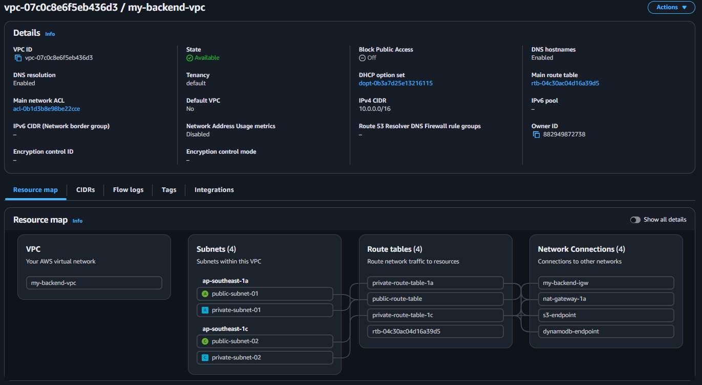

**Subnets**

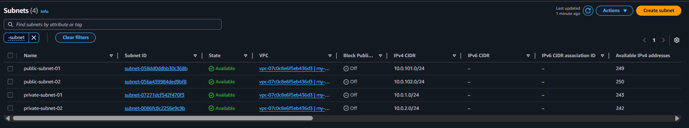

**Route Tables**

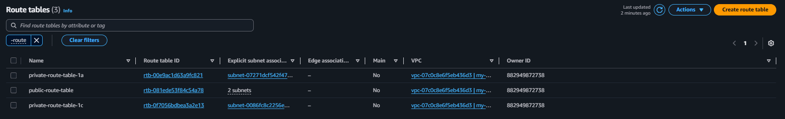

**NAT Gateway**

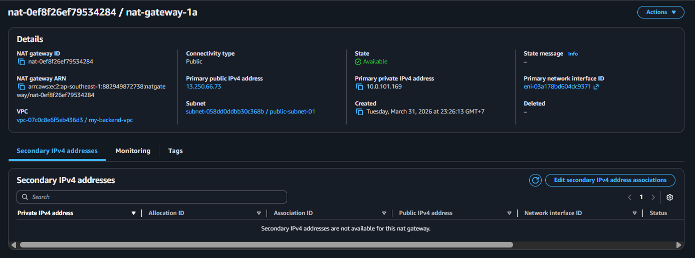

**Elastic IP**

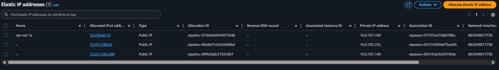

**VPC Endpoints**

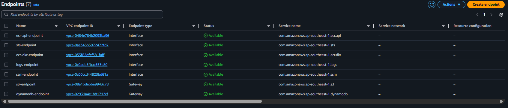

**Security Groups**

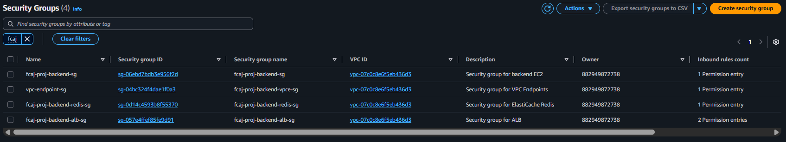

#### Load Balancer & Routing

**Application Load Balancer (ALB)**

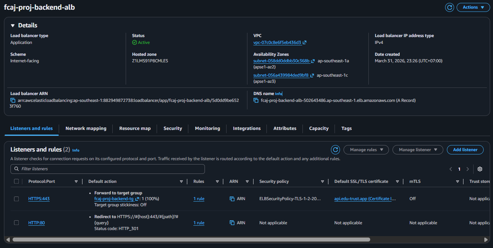

**Target Group (Summary)**

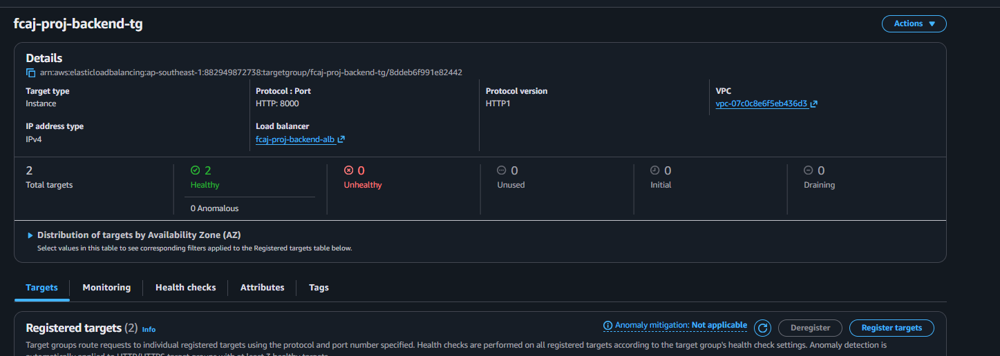

**Target Group (Targets)**

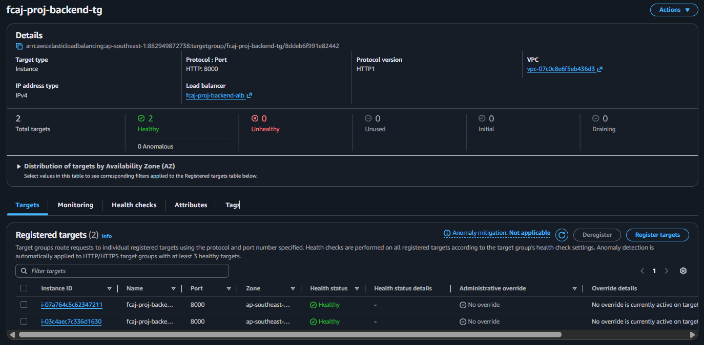

#### Compute

**Launch Template**

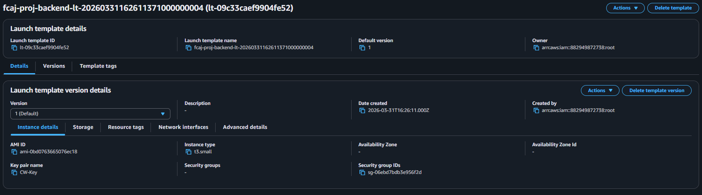

**Auto Scaling Group**

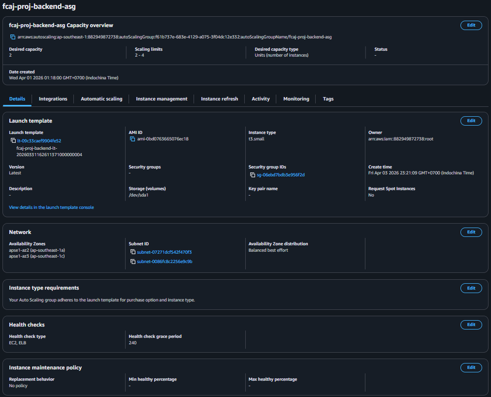

#### Storage

**S3 Buckets**

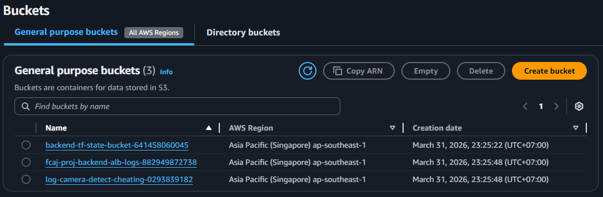

#### IAM & Security

**Backend IAM Role & Instance Profile**

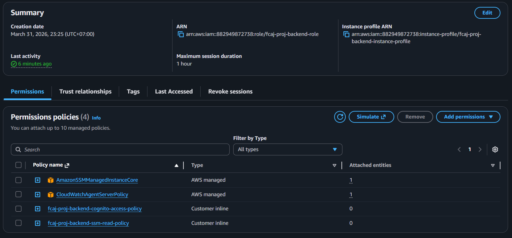

**EC2 Instances (Instance Profile)**

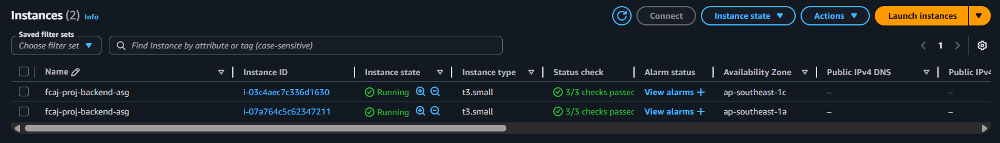

**VPC Flow Log IAM Role**

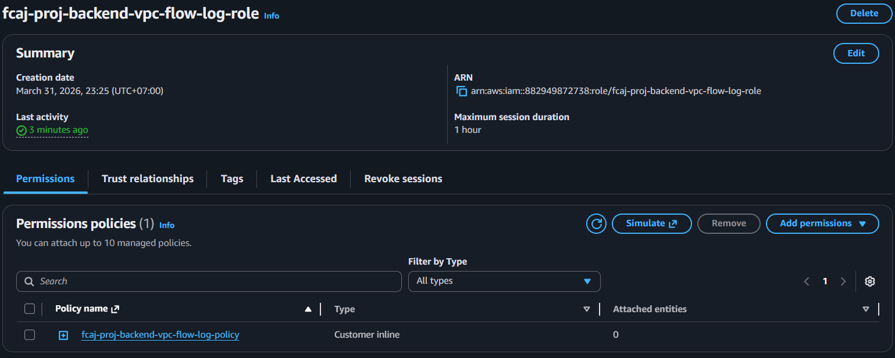

**KMS Key**

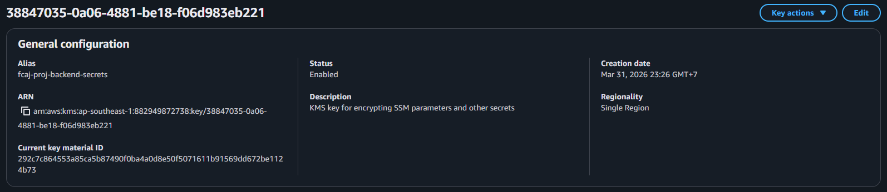

**SSM Parameter**

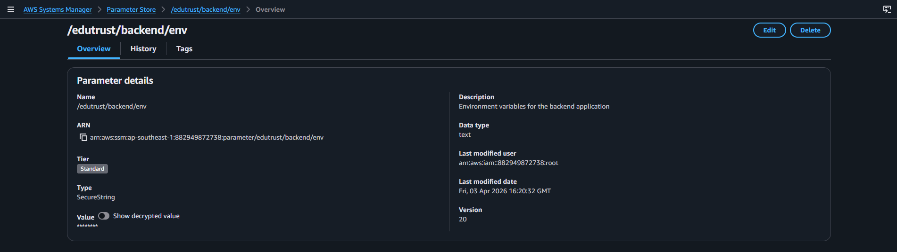

#### Identity (Cognito)

**User Pool**

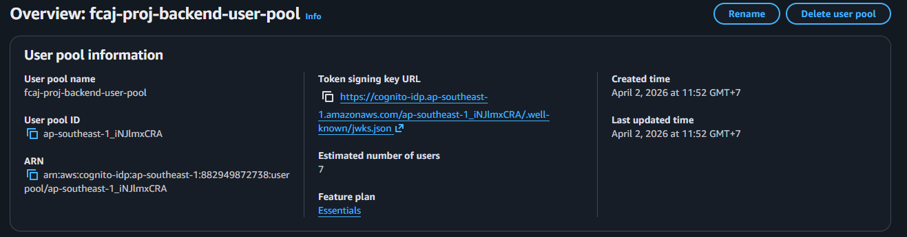

**App Client**

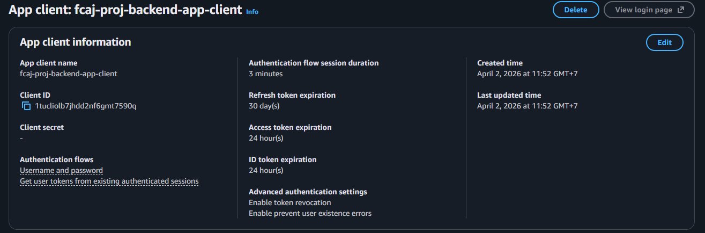

**Users**

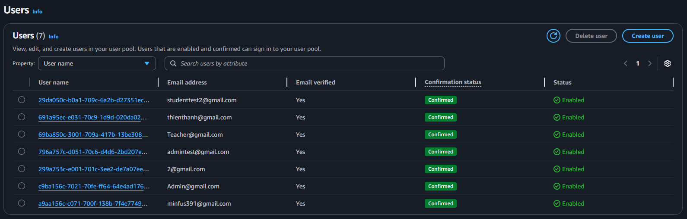

**Groups**

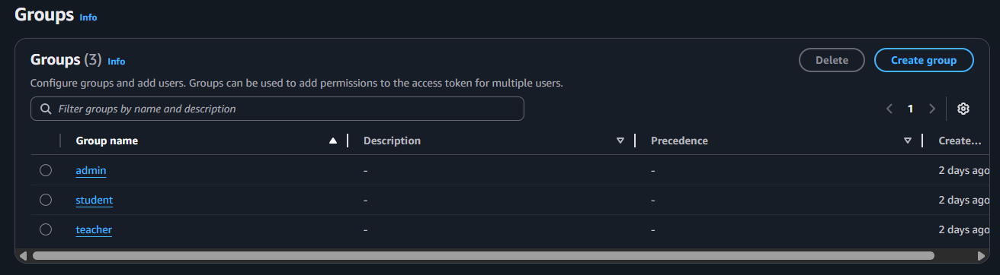

#### Observability

**CloudWatch Log Groups**

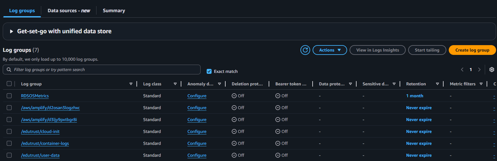

**CloudWatch Alarms**

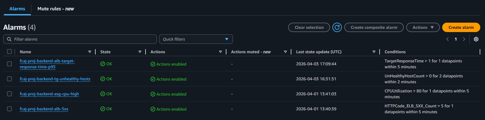

**SNS Topic**

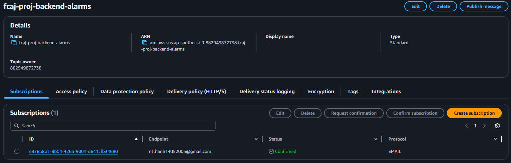

#### Container Registry

**ECR Repository**

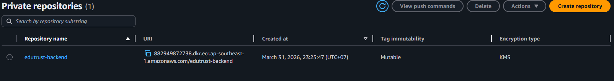

**ECR Images**

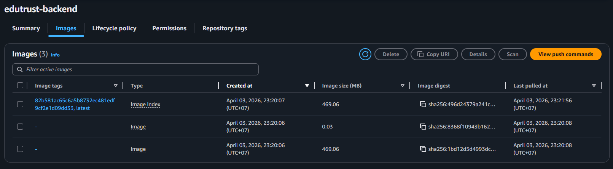

#### WAF

**Web Application Firewall**

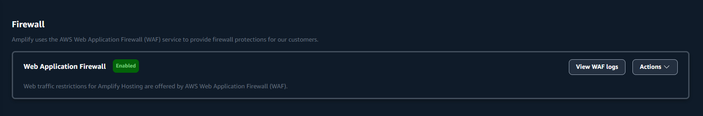
