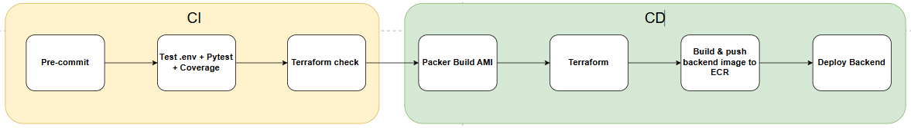

#### Overview

EduTrust's CI/CD pipeline is designed following a standardized model to ensure reproducibility, change traceability, and safety when deploying to staging/production environments. Instead of manual step-by-step operations, CI/CD automates the entire cycle from source code quality checks, artifact packaging, infrastructure updates to backend service rolling updates. This increases consistency between deployments, controls changes commit-by-commit for easy tracing/rollback, reduces configuration risks caused by manual operations, shortens the time to bring changes to the operational environment, and allows for further testing or security steps to be added as needed.

#### How it Works (Overview)

The pipeline is triggered when changes are merged into the main branch or when run manually (workflow_dispatch). It is split into two parts:

**CI (Continuous Integration):** the verification phase that checks formatting, linting, and basic tests to ensure code meets standards before building.

**CD (Continuous Delivery/Deployment):** the most important phase, consisting of 4 jobs executed in dependency order to keep infrastructure and artifacts synchronized.

- **Job Packer:** Builds a backend image with the application and dependencies pre-packaged.
- **Job Terraform:** Updates infrastructure according to Terraform (creating, changing, or destroying based on the plan).
- **Job Build ECR:** Builds & pushes Docker images to ECR to be used for the ASG.
- **Job ASG Rolling Update:** Deploys the new version using a rolling mechanism, ensuring no service disruption.

#### Content

1. [Job CI](4.5.1-ci/)
2. [Job Packer](4.5.2-packer/)
3. [Job Terraform](4.5.3-terraform/)
4. [Job Build ECR](4.5.4-build-ecr/)
5. [Job ASG Rolling Update](4.5.5-asg-rolling-update/)
