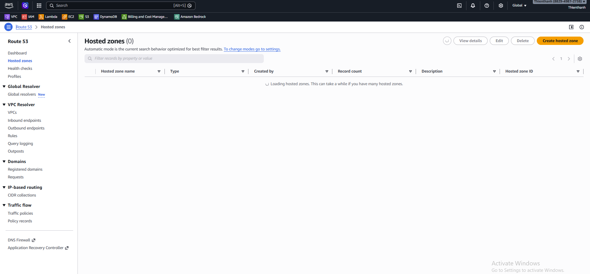
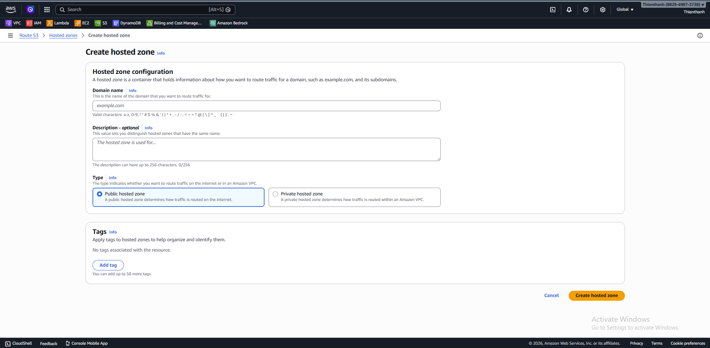
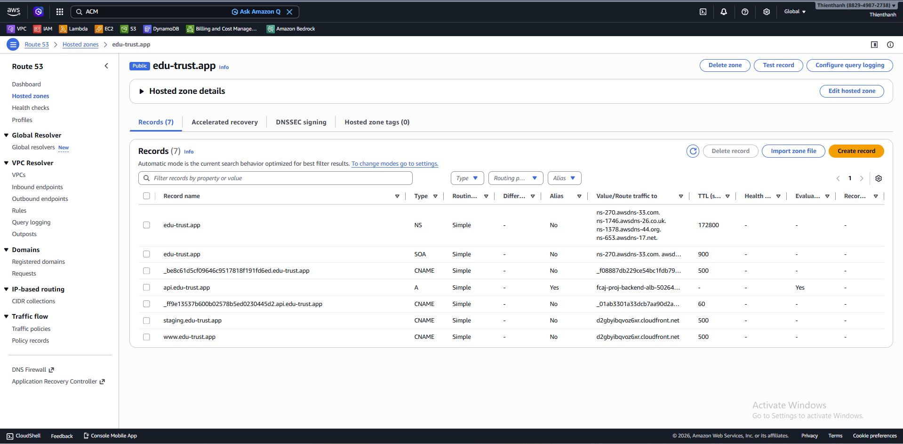
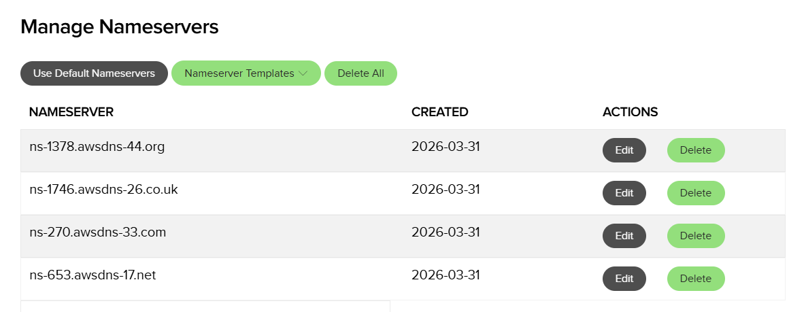

#### Tổng quan

Trong phần này, bạn thiết lập Route 53 cho domain mua ở nhà cung cấp bên ngoài (ví dụ Name.com). Mục tiêu là quản lý DNS record trong Route 53 để dùng cho các bước tiếp theo (bao gồm custom domain & HTTPS trên Amplify ở mục 4.6.2).

#### Các bước

1. Tạo Hosted Zone trong Route 53 cho domain.

   

   *Trong Route 53 → **Hosted zones**, chọn **Create hosted zone**.*

   

   *Nhập **Domain name**, giữ **Type = Public hosted zone**, sau đó bấm **Create hosted zone**.*

2. Lấy danh sách Nameservers (NS) từ Hosted Zone.

   

   *Mở Hosted Zone vừa tạo và sao chép 4 giá trị trong bản ghi **NS**.*

3. Vào Name.com và cập nhật Nameserver trỏ về Route 53.

   

   *Dán 4 Nameserver từ Route 53 vào mục **Manage Nameservers** trên Name.com và lưu thay đổi.*

4. Xác nhận DNS propagation hoàn tất.

   Bạn có thể kiểm tra bằng Route 53 **Test record** hoặc dùng terminal:

   ```bash
   nslookup -type=ns <ten-domain-cua-ban>
   ```
