#### Objectives

Deploy the frontend from GitHub to AWS Amplify for automated build and deployment.

#### Overview

AWS Amplify provides mechanisms for building, hosting, and publishing frontends per branch, integrating the build pipeline and supporting domain/HTTPS configuration.

#### Connecting GitHub Repo and Selecting Branch

1. Create a new Amplify app and select **GitHub** as the source provider.
2. Choose the EduTrust repository and the deployment branch (e.g. `main`). If your repo is a monorepo, set the root directory (e.g. `frontend`).

   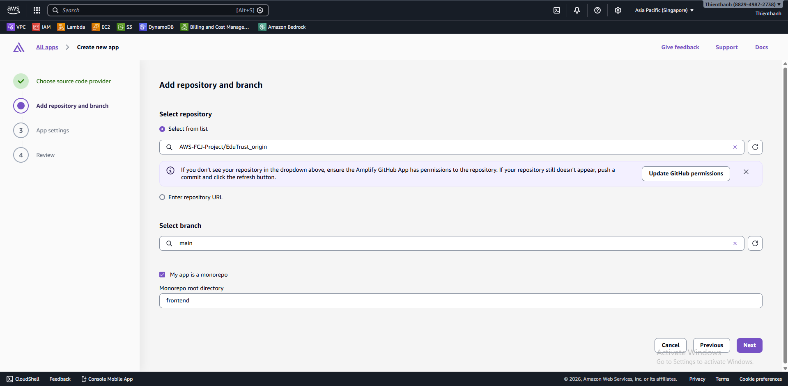

   *Select the repo/branch and set **Monorepo root directory** if applicable.*

3. Configure build settings (framework, build command, output directory).

   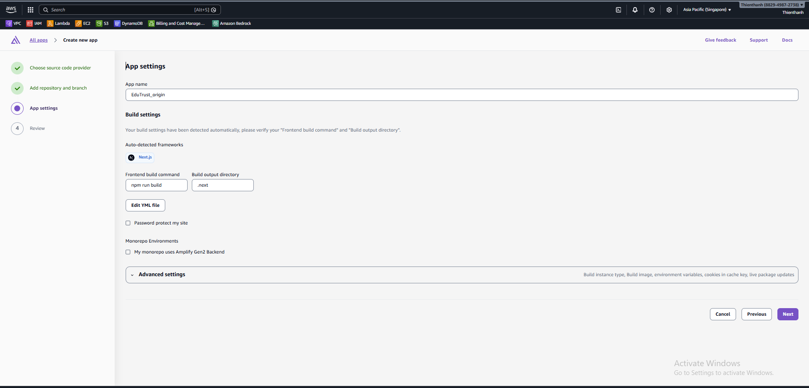

   *Verify the detected framework/build settings, then open **Advanced settings** if you need to add environment variables.*

4. Open **Advanced settings** and review build instance / environment variables.

   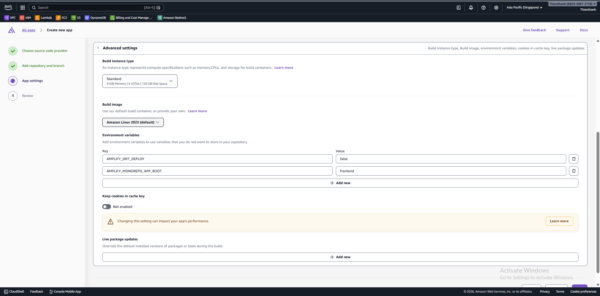

   *This is where you configure build resources and add environment variables for the build.*

5. Add environment variables required by the frontend (example: `NEXT_PUBLIC_API_URL`).

   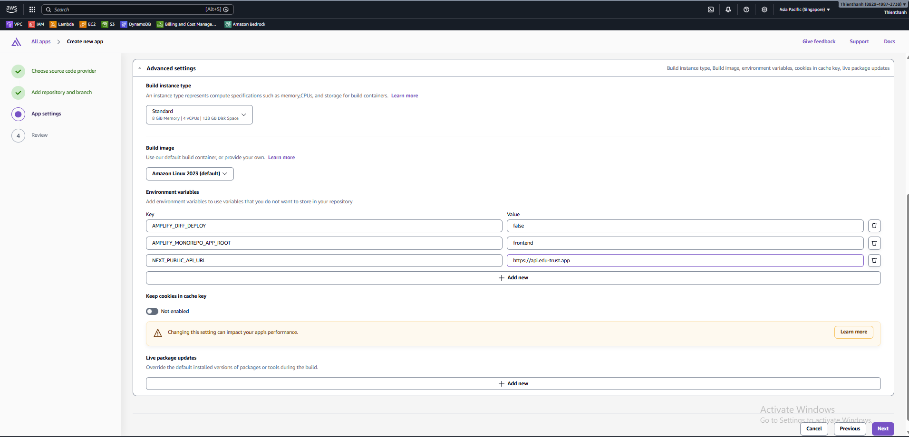

   *Add environment variables under **Advanced settings → Environment variables**.*

6. Review and choose **Save and deploy**.

   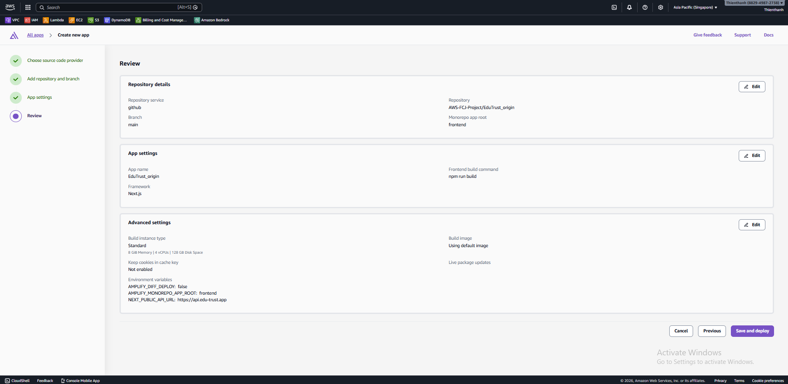

   *Double-check repo/branch/build settings and variables, then deploy.*

#### Custom Domain

Prerequisite: complete **4.6.1** so your domain is managed in Route 53 (nameservers already point to Route 53).

1. In Amplify, open your app → **Hosting → Domain management** → **Add domain**.

   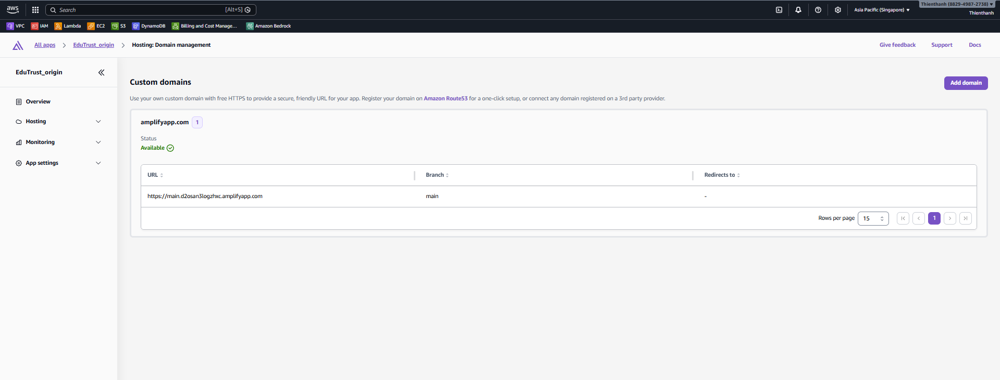

   *Go to **Hosting → Domain management** and choose **Add domain**.*

2. Enter your root domain (e.g. `edu-trust.app`) and continue.

   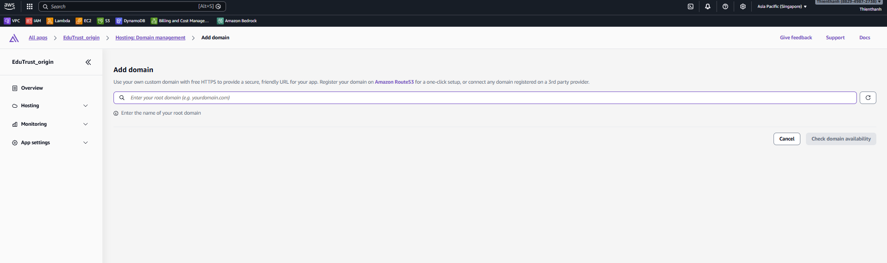

   *Enter your root domain and check domain availability.*

3. Configure subdomains (e.g. add `www`). If you do not want the root domain, choose **Exclude root**, then **Add domain**.

   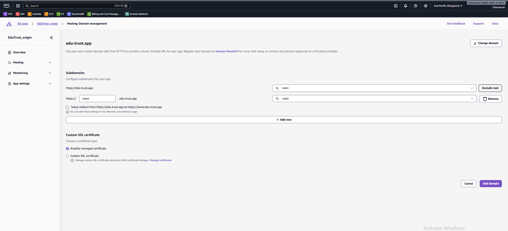

   *Add subdomains and choose **Exclude root** if needed.*

4. Amplify creates DNS validation / routing records. Confirm the records exist in Route 53.

   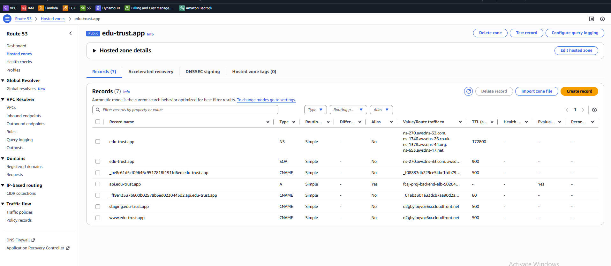

   *Verify Amplify-created records (CNAME/ALIAS) appear in the hosted zone.*

5. Wait until the domain status becomes **Available**, then open the domain to verify HTTPS.

   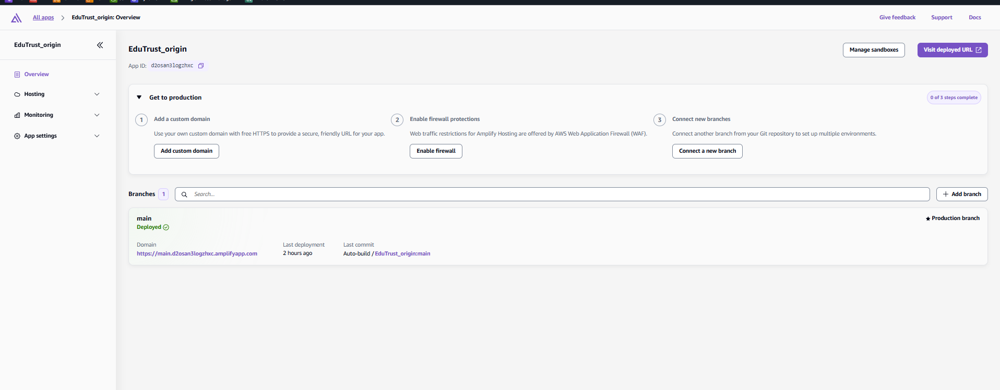

   *Wait for provisioning to finish, then click the domain URL to verify it loads with HTTPS.*

   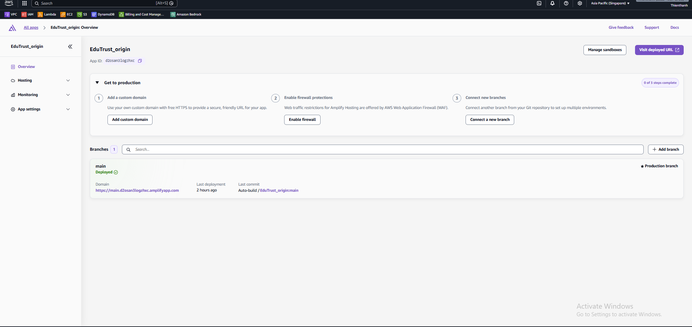

   *Domain shows **Available** when SSL and routing are ready.*

6. (Optional) If you manage your own SSL certificate (not Amplify-managed), verify the certificate status in ACM is **Issued**.

   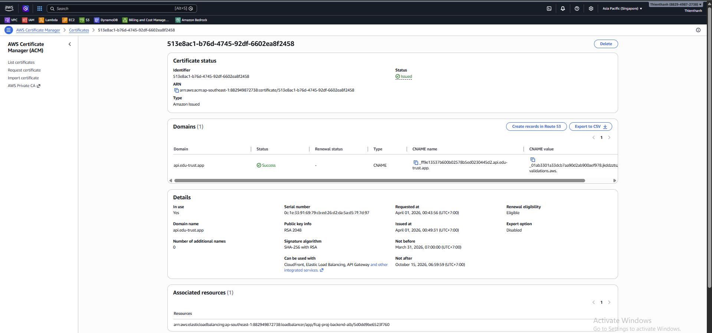

   *ACM shows **Issued** when DNS validation is complete.*

#### Build Configuration (amplify.yml)

`amplify.yml` tells Amplify Hosting how to install dependencies, build the frontend, and which build artifacts to publish.

**Where to put `amplify.yml`**

- Place `amplify.yml` at the **root of the GitHub repository** you connected to Amplify.
- If your repo is a monorepo, keep `amplify.yml` at the repo root and set `appRoot: frontend` (or your frontend folder). This matches the **Monorepo root directory** you set in the console.

**Example `amplify.yml` (Next.js in a monorepo)**

```yaml
version: 1
applications:
  - appRoot: frontend
    frontend:
      phases:
        preBuild:
          commands:
            - npm ci
        build:
          commands:
            - npm run build
      artifacts:
        baseDirectory: .next
        files:
          - "**/*"
      cache:
        paths:
          - node_modules/**/*
          - .next/cache/**/*
```

Notes:

- `artifacts.baseDirectory` must match your build output directory (for the screenshots above: `.next`).
- `cache` is optional. If builds feel slow, enabling cache usually reduces build time on subsequent deployments.

#### Frontend Environment Variables

Use Amplify environment variables to inject configuration at build time without hardcoding values in the repo.

**Common variables (example)**

```text
NEXT_PUBLIC_API_URL=https://api.edu-trust.app
NEXT_PUBLIC_AWS_REGION=ap-southeast-1
```

Notes:

- In Next.js, only variables prefixed with `NEXT_PUBLIC_` are exposed to browser code.
- Configure variables per branch/environment in Amplify (e.g. `main` vs `staging`) to avoid mixing endpoints.

**Example usage in code (Next.js)**

```ts
export const API_BASE_URL = process.env.NEXT_PUBLIC_API_URL ?? "";
```

#### Verify Successful Build

1. Confirm the build was successful in the Amplify Console.
2. Access the default Amplify URL and check the user interface display.
