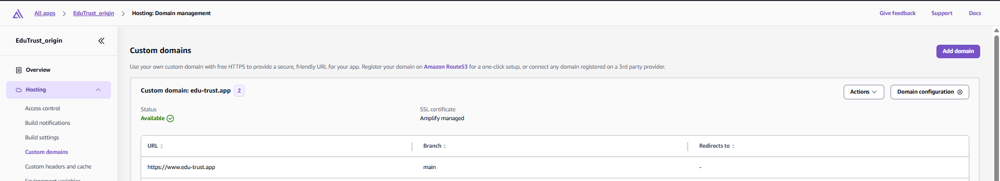
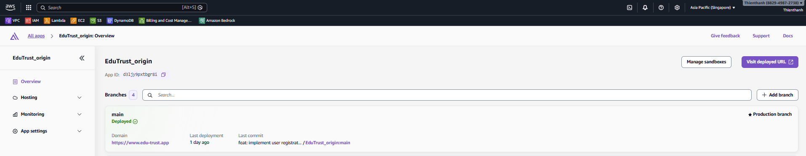

#### Mục tiêu

Triển khai frontend từ GitHub lên AWS Amplify để tự động build và deploy.

#### Tổng quan

AWS Amplify cung cấp cơ chế build, host và phát hành frontend theo nhánh, tích hợp pipeline build và hỗ trợ cấu hình domain/HTTPS.

#### Kết nối repo GitHub, chọn branch triển khai

1. Tạo ứng dụng Amplify mới và chọn **GitHub** làm nguồn code.
2. Chọn repo EduTrust và nhánh triển khai (ví dụ `main`). Nếu là monorepo thì nhập root directory (ví dụ `frontend`).

   

   *Chọn repo/branch và cấu hình **Monorepo root directory** nếu cần.*

3. Kiểm tra cấu hình build (framework, build command, output directory).

   

   *Xác nhận build settings, sau đó mở **Advanced settings** nếu cần thêm biến môi trường.*

4. Mở **Advanced settings** và kiểm tra build instance / environment variables.

   

   *Đây là nơi cấu hình tài nguyên build và thêm biến môi trường cho quá trình build.*

5. Thêm biến môi trường cho frontend (ví dụ `NEXT_PUBLIC_API_URL`).

   

   *Thêm biến trong **Advanced settings → Environment variables**.*

6. Review và bấm **Save and deploy**.

   

   *Kiểm tra lại repo/branch/build settings/variables rồi deploy.*

#### Custom domain

Điều kiện trước: hoàn tất **4.6.1** để domain đã được quản lý bởi Route 53 (nameserver đã trỏ về Route 53).

1. Vào Amplify, mở app → **Hosting → Custom Domains** → **Add domain**.

   

   *Vào **Hosting → Custom Domains** và chọn **Add domain**.*

2. Nhập root domain (ví dụ `edu-trust.app`) rồi tiếp tục.

   

   *Nhập root domain và kiểm tra domain availability.*

3. Cấu hình subdomain (ví dụ thêm `www`). Nếu không dùng root domain thì chọn **Exclude root**, sau đó bấm **Add domain**.

   

   *Thêm subdomain và chọn **Exclude root** nếu cần.*

4. Amplify sẽ tạo DNS validation / routing record. Kiểm tra các record đã có trong Route 53.

   

   *Xác nhận các record do Amplify tạo (CNAME/ALIAS) xuất hiện trong hosted zone.*

5. Chờ đến khi domain ở trạng thái **Available**, rồi mở domain để kiểm tra HTTPS.
   
   

   

   *Khi hiện **Available** nghĩa là SSL và routing đã sẵn sàng và domain đã được cập nhật.*

6. (Tuỳ chọn) Nếu bạn tự quản lý SSL certificate (không dùng Amplify-managed), kiểm tra chứng chỉ trong ACM ở trạng thái **Issued**.

   

   *ACM hiện **Issued** khi DNS validation đã hoàn tất.*

#### Cấu hình build (amplify.yml)

`amplify.yml` dùng để nói cho Amplify Hosting biết cách cài dependency, build frontend và thư mục artifact nào sẽ được publish.

**File `amplify.yml` đặt ở đâu?**

- Đặt `amplify.yml` ở **root của GitHub repo** mà bạn đã kết nối vào Amplify.
- Nếu repo là monorepo, vẫn để ở root repo và cấu hình `appRoot: frontend` (hoặc đúng thư mục FE). Cấu hình này nên khớp với **Monorepo root directory** bạn nhập trên Amplify Console.

**Ví dụ `amplify.yml` (Next.js trong monorepo)**

```yaml
version: 1
applications:
  - appRoot: frontend
    frontend:
      phases:
        preBuild:
          commands:
            - npm ci
        build:
          commands:
            - npm run build
      artifacts:
        baseDirectory: .next
        files:
          - "**/*"
      cache:
        paths:
          - node_modules/**/*
          - .next/cache/**/*
```

Ghi chú:

- `artifacts.baseDirectory` phải đúng với thư mục output sau khi build (theo hình bên trên là `.next`).
- `cache` là tuỳ chọn. Nếu build chậm, bật cache thường giúp các lần build sau nhanh hơn.


#### Biến môi trường FE

Biến môi trường trong Amplify giúp bạn cấu hình FE theo từng môi trường mà không cần hard-code vào repo.

**Biến thường dùng (ví dụ)**

```text
NEXT_PUBLIC_API_URL=https://api.edu-trust.app
NEXT_PUBLIC_AWS_REGION=ap-southeast-1
```

Ghi chú:

- Với Next.js, chỉ các biến có prefix `NEXT_PUBLIC_` mới được dùng ở phía trình duyệt (client).
- Nên tách biến theo từng branch/môi trường trên Amplify (ví dụ `main` vs `staging`) để không bị trỏ nhầm endpoint.

**Ví dụ dùng trong code (Next.js)**

```ts
export const API_BASE_URL = process.env.NEXT_PUBLIC_API_URL ?? "";
```


#### Kiểm tra build thành công

1. Xác nhận build thành công trong Amplify Console.
2. Truy cập URL mặc định của Amplify và kiểm tra hiển thị giao diện.
