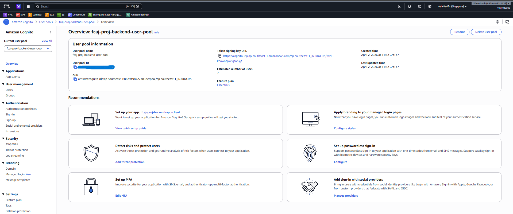
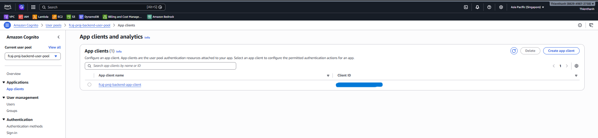
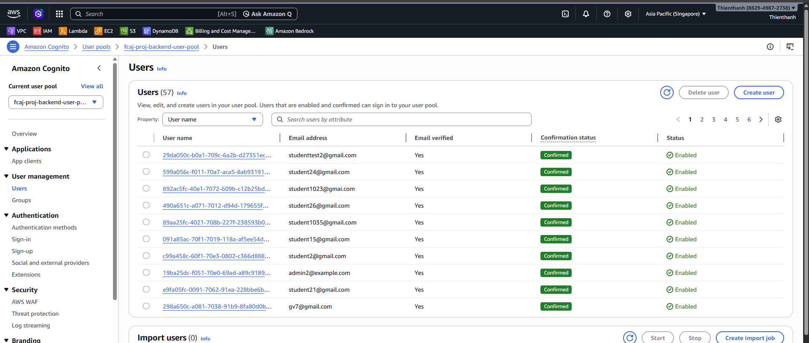
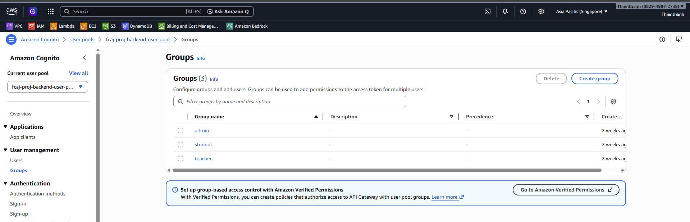

#### Mục tiêu

Tích hợp xác thực người dùng cho frontend để kiểm soát truy cập và phát hành token hợp lệ.

#### Tổng quan

Cognito cung cấp User Pool để quản lý người dùng và App Client để cấp token truy cập. Đây là lớp xác thực tiêu chuẩn cho frontend trong kiến trúc AWS.

#### Giải thích ngắn

- **User Pool**: nơi lưu trữ tài khoản người dùng, chính sách mật khẩu, nhóm quyền.
- **App Client**: cấu hình ứng dụng frontend nhận token sau khi đăng nhập.

#### Biến môi trường FE cần cấu hình

1. COGNITO_USER_POOL_ID: định danh User Pool.
   

   *Vào User Pool và lấy user pool id*

2. COGNITO_CLIENT_ID: định danh App Client.

   

   *Vào App Client và lấy app client id.*

3. COGNITO_REGION: region triển khai Cognito.

#### Kiểm tra login/logout, token và group

1. Đăng nhập và đăng xuất trên UI để kiểm tra trạng thái phiên.
2. Kiểm tra token trả về (ID/Access token) và xác nhận gọi API có Authorization hợp lệ.

   

   *Kiểm tra login/logout và token*

3. Kiểm tra group

   

   *Kiểm tra group*