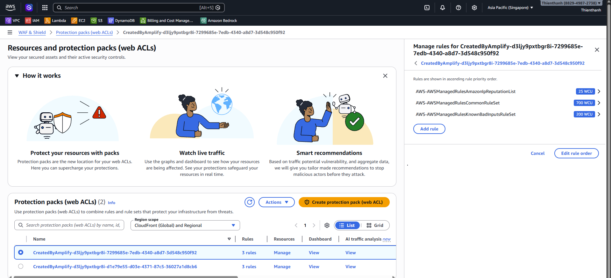

#### Mục tiêu

Bảo vệ layer frontend (CloudFront) bằng WAF.

#### Quản lý WAF do Amplify tạo

Khi triển khai ứng dụng bằng AWS Amplify, một Web ACL (WAF) thường đã được tự động tạo và gán cho CloudFront Distribution của frontend.

   

   *Kiểm tra WAF*

<!-- #### Lưu ý

1. Luôn ưu tiên bật chế độ theo dõi (Count) trước, kết hợp xem xét log CloudWatch, sau đó mới chuyển sang chế độ chặn hoàn toàn (Block) nếu cần thiết để tránh làm gián đoạn người dùng hợp lệ. -->
